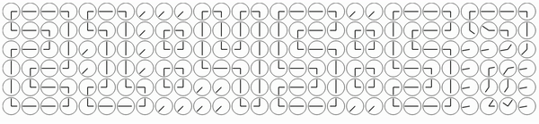

# What is it?
## [Demo page](https://pennyroyaltea.github.io/clocks/)

# But... what is it?
Digital clock made from many analog clocks, apparently.

# What for?
Artistic expression. 

Think of how digital things substitute for analog nowadays, even when redundant.

Or how a boring object might consist of many interesting small details, that make it one of a kind.

Or whatever.